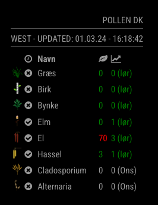

# MMM-Pollen-DK

A MagicMirror module to display the pollen status in Denmark.

Example:

## Preview

### Pollen table




MMM-Pollen-DK uses [astma-allergi.dk](https://www.astma-allergi.dk/umbraco/Api/PollenApi/GetPollenFeed) as a data source. 

Columns meaning: 
- Icon
- Is season or not
- Name
- Current pollen status
- Next upcomming pollen status

## Config Options

| Option | Default value | Description |
| ------ | ------------- | ----------- |
| `region` | `west` | The region in Denmark can either be `east` or `west` with the great belt bridge making the border. |
| `pollenTypes` | All types | If specified this needs to be an array like `["Græs", "Birk"]` |


All supported pollen types are:
- El
- Hassel
- Elm
- Birk
- Græs
- Bynke
- Alternaria
- Cladosporium

Example config:
```
		{
			module: "MMM-Pollen-DK",
			position: "top_right",
			config: {
				region: "west",
				pollenTypes: ["Græs", "Birk", "Bynke"]
			}
		}
```